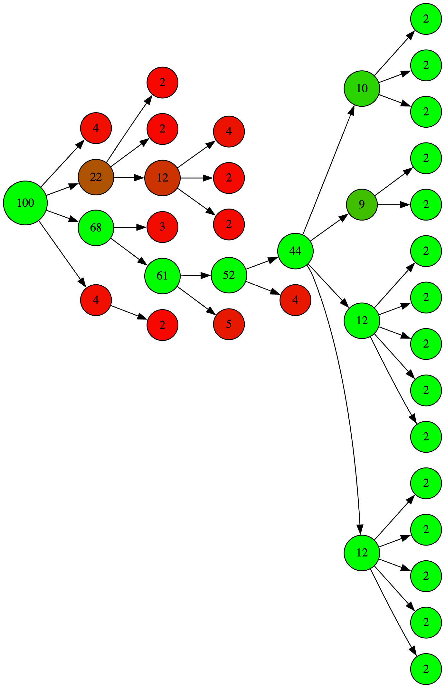

Basic implementation of IS-MCTS in rust.
Not intended to be used as a stable library: large changes may be made on a whim without changing semver.

For more information about IS-MCTS, see [Monte Carlo Tree Search for games with Hidden Information and Uncertainty](http://etheses.whiterose.ac.uk/8117/).

## Graph Visualization

ISMCTS supports generating Graphviz DOT files to visualize the search tree. This is useful for debugging and understanding how the algorithm explores the game tree.

### Enabling Graph Generation

To enable graph generation, create your ISMCTS handler with graph support:

```rust
let mut ismcts = IsmctsHandler::new_with_graph_support(game);
```

### Generating the DOT File

After running iterations, generate the DOT string:

```rust
ismcts.run_iterations(1, 1000);
let dot_graph = ismcts.dotty_graph_string();
std::fs::write("search_tree.dot", dot_graph)?;
```

### Converting to PNG

Use Graphviz to convert the DOT file to an image:

```bash
dot -Tpng search_tree.dot -o search_tree.png
```

Here is an example search tree from a bid Euchre variant called Kaibosh:




## License

Licensed under either of

 * Apache License, Version 2.0, ([LICENSE-APACHE](LICENSE-APACHE) or http://www.apache.org/licenses/LICENSE-2.0)
 * MIT license ([LICENSE-MIT](LICENSE-MIT) or http://opensource.org/licenses/MIT)

at your option.
